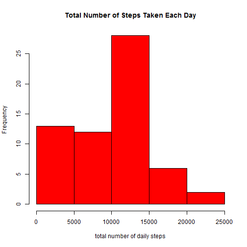
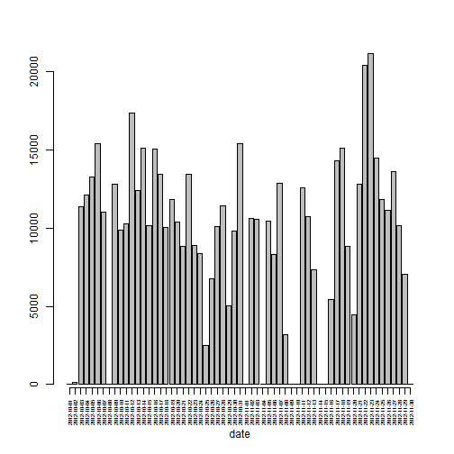
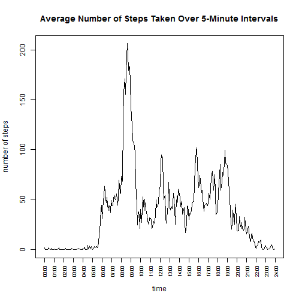
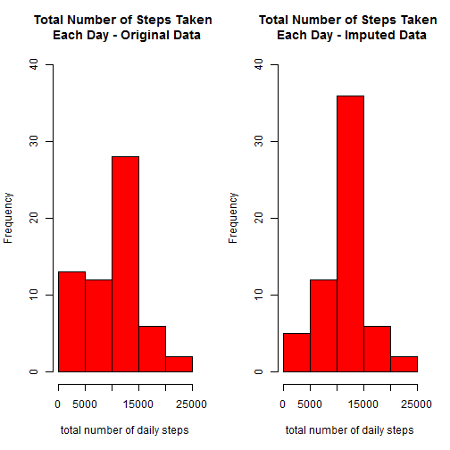
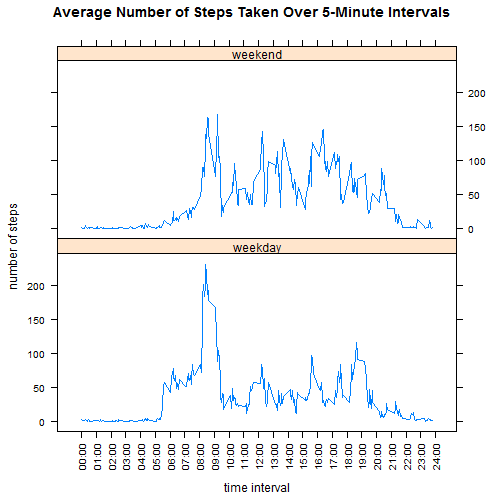

Reproducible Data Programming Assignment 1
========================================================

## Loading packages

We will need the following packages to run this code:

* dplyr
* xtable
* lattice


## Loading and preprocessing the data

Let's load the data and look at its structure.


```r
ActivityData <- read.csv(file = "activity.csv")
str(ActivityData)
```

```
## 'data.frame':	17568 obs. of  3 variables:
##  $ steps   : int  NA NA NA NA NA NA NA NA NA NA ...
##  $ date    : Factor w/ 61 levels "2012-10-01","2012-10-02",..: 1 1 1 1 1 1 1 1 1 1 ...
##  $ interval: int  0 5 10 15 20 25 30 35 40 45 ...
```

The structure of the data is actually just fine.  Keeping the dates as factors (61 levels for days) allows us to filter on those levels, which will be convenient for use later on.

## What is the mean total number of steps taken per day?

For now we'll ignore the missing values by invoking `na.rm = TRUE`.  We'll start by grouping the data by date and then summarizing the data by that grouping variable (essentially getting us a summary by day).  Use the dplyr package to make this easier.  


```r
ActivityByDay <- group_by(ActivityData, date)
ActivitySummary <- summarise(ActivityByDay, DailyTotal = sum(steps, na.rm = TRUE), DailyMean = mean(steps, na.rm = TRUE), DailyMedian = median(steps, na.rm = TRUE))
```

Now lets make histogram of the total number of steps taken each day.


```r
hist(ActivitySummary$DailyTotal,
     col = 'red',
     main = 'Total Number of Steps Taken Each Day',
     xlab = 'total number of daily steps')
```

 

Notice that this is different from a bar plot, as shown below:


```r
bp <- barplot(ActivitySummary$DailyTotal, xlab = 'date', axes = FALSE, axisnames = FALSE)
axis(1, at = bp, labels = ActivitySummary$date, cex.axis = 0.5, las = 2)
axis(2)
```

 

Now lets print out the daily summarized data.  Use the `xtable` package to make this table look pretty.  Also, note that you must request `results = 'asis'` in the __R__ chunk in order to get __R__ to actually print out the html formatted results.  Without the `asis` request, you'll get a bunch of html code and the table won't be pretty at all.


```r
xt <- xtable(ActivitySummary[1:61,c(1,3,4)])
print(xt, include.rownames = FALSE, type = "html")
```

<!-- html table generated in R 3.1.0 by xtable 1.7-4 package -->
<!-- Thu Jun 11 23:52:55 2015 -->
<table border=1>
<tr> <th> date </th> <th> DailyMean </th> <th> DailyMedian </th>  </tr>
  <tr> <td> 2012-10-01 </td> <td align="right">  </td> <td align="right">  </td> </tr>
  <tr> <td> 2012-10-02 </td> <td align="right"> 0.44 </td> <td align="right"> 0.00 </td> </tr>
  <tr> <td> 2012-10-03 </td> <td align="right"> 39.42 </td> <td align="right"> 0.00 </td> </tr>
  <tr> <td> 2012-10-04 </td> <td align="right"> 42.07 </td> <td align="right"> 0.00 </td> </tr>
  <tr> <td> 2012-10-05 </td> <td align="right"> 46.16 </td> <td align="right"> 0.00 </td> </tr>
  <tr> <td> 2012-10-06 </td> <td align="right"> 53.54 </td> <td align="right"> 0.00 </td> </tr>
  <tr> <td> 2012-10-07 </td> <td align="right"> 38.25 </td> <td align="right"> 0.00 </td> </tr>
  <tr> <td> 2012-10-08 </td> <td align="right">  </td> <td align="right">  </td> </tr>
  <tr> <td> 2012-10-09 </td> <td align="right"> 44.48 </td> <td align="right"> 0.00 </td> </tr>
  <tr> <td> 2012-10-10 </td> <td align="right"> 34.38 </td> <td align="right"> 0.00 </td> </tr>
  <tr> <td> 2012-10-11 </td> <td align="right"> 35.78 </td> <td align="right"> 0.00 </td> </tr>
  <tr> <td> 2012-10-12 </td> <td align="right"> 60.35 </td> <td align="right"> 0.00 </td> </tr>
  <tr> <td> 2012-10-13 </td> <td align="right"> 43.15 </td> <td align="right"> 0.00 </td> </tr>
  <tr> <td> 2012-10-14 </td> <td align="right"> 52.42 </td> <td align="right"> 0.00 </td> </tr>
  <tr> <td> 2012-10-15 </td> <td align="right"> 35.20 </td> <td align="right"> 0.00 </td> </tr>
  <tr> <td> 2012-10-16 </td> <td align="right"> 52.38 </td> <td align="right"> 0.00 </td> </tr>
  <tr> <td> 2012-10-17 </td> <td align="right"> 46.71 </td> <td align="right"> 0.00 </td> </tr>
  <tr> <td> 2012-10-18 </td> <td align="right"> 34.92 </td> <td align="right"> 0.00 </td> </tr>
  <tr> <td> 2012-10-19 </td> <td align="right"> 41.07 </td> <td align="right"> 0.00 </td> </tr>
  <tr> <td> 2012-10-20 </td> <td align="right"> 36.09 </td> <td align="right"> 0.00 </td> </tr>
  <tr> <td> 2012-10-21 </td> <td align="right"> 30.63 </td> <td align="right"> 0.00 </td> </tr>
  <tr> <td> 2012-10-22 </td> <td align="right"> 46.74 </td> <td align="right"> 0.00 </td> </tr>
  <tr> <td> 2012-10-23 </td> <td align="right"> 30.97 </td> <td align="right"> 0.00 </td> </tr>
  <tr> <td> 2012-10-24 </td> <td align="right"> 29.01 </td> <td align="right"> 0.00 </td> </tr>
  <tr> <td> 2012-10-25 </td> <td align="right"> 8.65 </td> <td align="right"> 0.00 </td> </tr>
  <tr> <td> 2012-10-26 </td> <td align="right"> 23.53 </td> <td align="right"> 0.00 </td> </tr>
  <tr> <td> 2012-10-27 </td> <td align="right"> 35.14 </td> <td align="right"> 0.00 </td> </tr>
  <tr> <td> 2012-10-28 </td> <td align="right"> 39.78 </td> <td align="right"> 0.00 </td> </tr>
  <tr> <td> 2012-10-29 </td> <td align="right"> 17.42 </td> <td align="right"> 0.00 </td> </tr>
  <tr> <td> 2012-10-30 </td> <td align="right"> 34.09 </td> <td align="right"> 0.00 </td> </tr>
  <tr> <td> 2012-10-31 </td> <td align="right"> 53.52 </td> <td align="right"> 0.00 </td> </tr>
  <tr> <td> 2012-11-01 </td> <td align="right">  </td> <td align="right">  </td> </tr>
  <tr> <td> 2012-11-02 </td> <td align="right"> 36.81 </td> <td align="right"> 0.00 </td> </tr>
  <tr> <td> 2012-11-03 </td> <td align="right"> 36.70 </td> <td align="right"> 0.00 </td> </tr>
  <tr> <td> 2012-11-04 </td> <td align="right">  </td> <td align="right">  </td> </tr>
  <tr> <td> 2012-11-05 </td> <td align="right"> 36.25 </td> <td align="right"> 0.00 </td> </tr>
  <tr> <td> 2012-11-06 </td> <td align="right"> 28.94 </td> <td align="right"> 0.00 </td> </tr>
  <tr> <td> 2012-11-07 </td> <td align="right"> 44.73 </td> <td align="right"> 0.00 </td> </tr>
  <tr> <td> 2012-11-08 </td> <td align="right"> 11.18 </td> <td align="right"> 0.00 </td> </tr>
  <tr> <td> 2012-11-09 </td> <td align="right">  </td> <td align="right">  </td> </tr>
  <tr> <td> 2012-11-10 </td> <td align="right">  </td> <td align="right">  </td> </tr>
  <tr> <td> 2012-11-11 </td> <td align="right"> 43.78 </td> <td align="right"> 0.00 </td> </tr>
  <tr> <td> 2012-11-12 </td> <td align="right"> 37.38 </td> <td align="right"> 0.00 </td> </tr>
  <tr> <td> 2012-11-13 </td> <td align="right"> 25.47 </td> <td align="right"> 0.00 </td> </tr>
  <tr> <td> 2012-11-14 </td> <td align="right">  </td> <td align="right">  </td> </tr>
  <tr> <td> 2012-11-15 </td> <td align="right"> 0.14 </td> <td align="right"> 0.00 </td> </tr>
  <tr> <td> 2012-11-16 </td> <td align="right"> 18.89 </td> <td align="right"> 0.00 </td> </tr>
  <tr> <td> 2012-11-17 </td> <td align="right"> 49.79 </td> <td align="right"> 0.00 </td> </tr>
  <tr> <td> 2012-11-18 </td> <td align="right"> 52.47 </td> <td align="right"> 0.00 </td> </tr>
  <tr> <td> 2012-11-19 </td> <td align="right"> 30.70 </td> <td align="right"> 0.00 </td> </tr>
  <tr> <td> 2012-11-20 </td> <td align="right"> 15.53 </td> <td align="right"> 0.00 </td> </tr>
  <tr> <td> 2012-11-21 </td> <td align="right"> 44.40 </td> <td align="right"> 0.00 </td> </tr>
  <tr> <td> 2012-11-22 </td> <td align="right"> 70.93 </td> <td align="right"> 0.00 </td> </tr>
  <tr> <td> 2012-11-23 </td> <td align="right"> 73.59 </td> <td align="right"> 0.00 </td> </tr>
  <tr> <td> 2012-11-24 </td> <td align="right"> 50.27 </td> <td align="right"> 0.00 </td> </tr>
  <tr> <td> 2012-11-25 </td> <td align="right"> 41.09 </td> <td align="right"> 0.00 </td> </tr>
  <tr> <td> 2012-11-26 </td> <td align="right"> 38.76 </td> <td align="right"> 0.00 </td> </tr>
  <tr> <td> 2012-11-27 </td> <td align="right"> 47.38 </td> <td align="right"> 0.00 </td> </tr>
  <tr> <td> 2012-11-28 </td> <td align="right"> 35.36 </td> <td align="right"> 0.00 </td> </tr>
  <tr> <td> 2012-11-29 </td> <td align="right"> 24.47 </td> <td align="right"> 0.00 </td> </tr>
  <tr> <td> 2012-11-30 </td> <td align="right">  </td> <td align="right">  </td> </tr>
   </table>

## What is the average daily activity pattern?

Now let's group the data by time interval and then graph an average number of steps taken during each time interval.


```r
ActivityByInterval <- group_by(ActivityData, interval)
ActivityIntSummary <- summarise(ActivityByInterval, IntervalMean = mean(steps, na.rm = TRUE))

plot(ActivityIntSummary$IntervalMean,
     type = "l",
     main = "Average Number of Steps Taken Over 5-Minute Intervals",
     xlab = "time",
     ylab = "number of steps",
     xaxt = "n")
intervals <- substr(as.POSIXct(sprintf("%04.0f", ActivityIntSummary$interval), format='%H%M'), 12, 16)
intervals <- c(intervals, "24:00")
axis(1, at = seq(1,289,12), labels = intervals[seq(1,289,12)], cex.axis = 0.7, las = 2)
```

 

```r
maxIntervalVal <- max(ActivityIntSummary$IntervalMean)
maxIntervalTime <- ActivityIntSummary[ActivityIntSummary$IntervalMean==maxIntervalVal,1]
maxIntervalTimePer <- substr(as.POSIXct(sprintf("%04.0f", maxIntervalTime), format='%H%M'), 12, 16)
```

Note that the maximum average number of steps taken over a 5-minute interval occurs at 08:35.  At that time, an average of 206.17 steps were taken.  Perhaps the person who wore this fitness tracker walked to work every morning or did a morning workout that involves a lot of walking or running.

## Imputing missing values

There are a lot of missing values (coded as `NA`).  Let's count exactly how many observations have missing values.


```r
JustNA <- ActivityData[ActivityData$steps == 'NA',]
NumberNAs <- nrow(JustNA)
```

So it turns out that there are 2304 `NA` values in the data set.  This number represents the 8 days that do not have any data.

The `NA` values need to be replaced.  The technical term for this process is called "imputing" the values.  To do this, we will go through the original data set and search for the `NA` values in the `steps` variable.  If we find an `NA`, we'll replace that value with the mean of the number of steps for that time interval (based on the rest of the data that has values during that time interval).  Essentially, this is done by creating a vector of mean steps by time interval for each day (the first loop below) and then replacing the values in the original data frame with the value from this newly created vector whenever an `NA` is encountered in the original data frame (the second loop below).


```r
ActivityDataMeans = ActivityData
for (i in 1:61 ) {
  for (j in 1:288){
    ActivityDataMeans$steps[(i-1)*288+j] = ActivityIntSummary$IntervalMean[j]
  }
}

ActivityDataNoNA = ActivityData
for (i in 1:17568){
  if(is.na(ActivityDataNoNA$steps[i])){
    ActivityDataNoNA$steps[i] = ActivityDataMeans$steps[i]
  }
}

JustNANoNA <- ActivityDataNoNA[ActivityDataNoNA$steps == 'NA',]
NumberNAsNoNA <- nrow(JustNANoNA)
```

Now we have 0 `NA` values in the data set, as expected.  Let's reproduce the histogram of the total number of steps taken each day and see what happened.


```r
ActivityByDayNoNA <- group_by(ActivityDataNoNA, date)
ActivitySummaryNoNA <- summarise(ActivityByDayNoNA, DailyTotal = sum(steps), DailyMean = mean(steps), DailyMedian = median(steps))
par(mfrow = c(1,2))
hist(ActivitySummary$DailyTotal,
     col = 'red',
     main = 'Total Number of Steps Taken \n Each Day - Original Data',
     xlab = 'total number of daily steps',
     ylim = c(0,40))
hist(ActivitySummaryNoNA$DailyTotal,
     col = 'red',
     main = 'Total Number of Steps Taken \n Each Day - Imputed Data',
     xlab = 'total number of daily steps',
     ylim = c(0,40))
```

 

```r
par(mfrow = c(1,1))
```

Looking at these histograms, we see how a lot of the low frequence data (in the first bin) got shifted to the middle frequency bin and that the other bins (the second one and the last two) didn't change at all.  This actually makes sense, because these histograms depict __total__ steps, so we would expect all the days with no activity (the days with all `NA` values in the original dataset) to originally show up in the first bin as 0's.  Now that we've imputed values for them using the means of each time interval, those 0's have become pretty significant numbers and moved to the middle bin.

Let's compare the summary statistics of these two data sets (original and imputed) side-by-side.


```r
DataCombined = cbind(ActivitySummary$date, ActivitySummary$DailyTotal, ActivitySummaryNoNA$DailyTotal, ActivitySummary$DailyMean, ActivitySummaryNoNA$DailyMean, ActivitySummary$DailyMedian, ActivitySummaryNoNA$DailyMedian)
colnames(DataCombined) <- c("Date", "Original_Daily_Total", "Imputed_Daily_Total", "Original_Daily_Mean", "Imputed_Daily_Mean", "Original_Daily_Median",  "Imputed_Daily_Median")

xtALL <- xtable(DataCombined[1:61,])
print(xtALL, include.rownames = FALSE, type = "html")
```

<!-- html table generated in R 3.1.0 by xtable 1.7-4 package -->
<!-- Thu Jun 11 23:52:56 2015 -->
<table border=1>
<tr> <th> Date </th> <th> Original_Daily_Total </th> <th> Imputed_Daily_Total </th> <th> Original_Daily_Mean </th> <th> Imputed_Daily_Mean </th> <th> Original_Daily_Median </th> <th> Imputed_Daily_Median </th>  </tr>
  <tr> <td align="right"> 1.00 </td> <td align="right"> 0.00 </td> <td align="right"> 10766.19 </td> <td align="right">  </td> <td align="right"> 37.38 </td> <td align="right">  </td> <td align="right"> 34.11 </td> </tr>
  <tr> <td align="right"> 2.00 </td> <td align="right"> 126.00 </td> <td align="right"> 126.00 </td> <td align="right"> 0.44 </td> <td align="right"> 0.44 </td> <td align="right"> 0.00 </td> <td align="right"> 0.00 </td> </tr>
  <tr> <td align="right"> 3.00 </td> <td align="right"> 11352.00 </td> <td align="right"> 11352.00 </td> <td align="right"> 39.42 </td> <td align="right"> 39.42 </td> <td align="right"> 0.00 </td> <td align="right"> 0.00 </td> </tr>
  <tr> <td align="right"> 4.00 </td> <td align="right"> 12116.00 </td> <td align="right"> 12116.00 </td> <td align="right"> 42.07 </td> <td align="right"> 42.07 </td> <td align="right"> 0.00 </td> <td align="right"> 0.00 </td> </tr>
  <tr> <td align="right"> 5.00 </td> <td align="right"> 13294.00 </td> <td align="right"> 13294.00 </td> <td align="right"> 46.16 </td> <td align="right"> 46.16 </td> <td align="right"> 0.00 </td> <td align="right"> 0.00 </td> </tr>
  <tr> <td align="right"> 6.00 </td> <td align="right"> 15420.00 </td> <td align="right"> 15420.00 </td> <td align="right"> 53.54 </td> <td align="right"> 53.54 </td> <td align="right"> 0.00 </td> <td align="right"> 0.00 </td> </tr>
  <tr> <td align="right"> 7.00 </td> <td align="right"> 11015.00 </td> <td align="right"> 11015.00 </td> <td align="right"> 38.25 </td> <td align="right"> 38.25 </td> <td align="right"> 0.00 </td> <td align="right"> 0.00 </td> </tr>
  <tr> <td align="right"> 8.00 </td> <td align="right"> 0.00 </td> <td align="right"> 10766.19 </td> <td align="right">  </td> <td align="right"> 37.38 </td> <td align="right">  </td> <td align="right"> 34.11 </td> </tr>
  <tr> <td align="right"> 9.00 </td> <td align="right"> 12811.00 </td> <td align="right"> 12811.00 </td> <td align="right"> 44.48 </td> <td align="right"> 44.48 </td> <td align="right"> 0.00 </td> <td align="right"> 0.00 </td> </tr>
  <tr> <td align="right"> 10.00 </td> <td align="right"> 9900.00 </td> <td align="right"> 9900.00 </td> <td align="right"> 34.38 </td> <td align="right"> 34.38 </td> <td align="right"> 0.00 </td> <td align="right"> 0.00 </td> </tr>
  <tr> <td align="right"> 11.00 </td> <td align="right"> 10304.00 </td> <td align="right"> 10304.00 </td> <td align="right"> 35.78 </td> <td align="right"> 35.78 </td> <td align="right"> 0.00 </td> <td align="right"> 0.00 </td> </tr>
  <tr> <td align="right"> 12.00 </td> <td align="right"> 17382.00 </td> <td align="right"> 17382.00 </td> <td align="right"> 60.35 </td> <td align="right"> 60.35 </td> <td align="right"> 0.00 </td> <td align="right"> 0.00 </td> </tr>
  <tr> <td align="right"> 13.00 </td> <td align="right"> 12426.00 </td> <td align="right"> 12426.00 </td> <td align="right"> 43.15 </td> <td align="right"> 43.15 </td> <td align="right"> 0.00 </td> <td align="right"> 0.00 </td> </tr>
  <tr> <td align="right"> 14.00 </td> <td align="right"> 15098.00 </td> <td align="right"> 15098.00 </td> <td align="right"> 52.42 </td> <td align="right"> 52.42 </td> <td align="right"> 0.00 </td> <td align="right"> 0.00 </td> </tr>
  <tr> <td align="right"> 15.00 </td> <td align="right"> 10139.00 </td> <td align="right"> 10139.00 </td> <td align="right"> 35.20 </td> <td align="right"> 35.20 </td> <td align="right"> 0.00 </td> <td align="right"> 0.00 </td> </tr>
  <tr> <td align="right"> 16.00 </td> <td align="right"> 15084.00 </td> <td align="right"> 15084.00 </td> <td align="right"> 52.38 </td> <td align="right"> 52.38 </td> <td align="right"> 0.00 </td> <td align="right"> 0.00 </td> </tr>
  <tr> <td align="right"> 17.00 </td> <td align="right"> 13452.00 </td> <td align="right"> 13452.00 </td> <td align="right"> 46.71 </td> <td align="right"> 46.71 </td> <td align="right"> 0.00 </td> <td align="right"> 0.00 </td> </tr>
  <tr> <td align="right"> 18.00 </td> <td align="right"> 10056.00 </td> <td align="right"> 10056.00 </td> <td align="right"> 34.92 </td> <td align="right"> 34.92 </td> <td align="right"> 0.00 </td> <td align="right"> 0.00 </td> </tr>
  <tr> <td align="right"> 19.00 </td> <td align="right"> 11829.00 </td> <td align="right"> 11829.00 </td> <td align="right"> 41.07 </td> <td align="right"> 41.07 </td> <td align="right"> 0.00 </td> <td align="right"> 0.00 </td> </tr>
  <tr> <td align="right"> 20.00 </td> <td align="right"> 10395.00 </td> <td align="right"> 10395.00 </td> <td align="right"> 36.09 </td> <td align="right"> 36.09 </td> <td align="right"> 0.00 </td> <td align="right"> 0.00 </td> </tr>
  <tr> <td align="right"> 21.00 </td> <td align="right"> 8821.00 </td> <td align="right"> 8821.00 </td> <td align="right"> 30.63 </td> <td align="right"> 30.63 </td> <td align="right"> 0.00 </td> <td align="right"> 0.00 </td> </tr>
  <tr> <td align="right"> 22.00 </td> <td align="right"> 13460.00 </td> <td align="right"> 13460.00 </td> <td align="right"> 46.74 </td> <td align="right"> 46.74 </td> <td align="right"> 0.00 </td> <td align="right"> 0.00 </td> </tr>
  <tr> <td align="right"> 23.00 </td> <td align="right"> 8918.00 </td> <td align="right"> 8918.00 </td> <td align="right"> 30.97 </td> <td align="right"> 30.97 </td> <td align="right"> 0.00 </td> <td align="right"> 0.00 </td> </tr>
  <tr> <td align="right"> 24.00 </td> <td align="right"> 8355.00 </td> <td align="right"> 8355.00 </td> <td align="right"> 29.01 </td> <td align="right"> 29.01 </td> <td align="right"> 0.00 </td> <td align="right"> 0.00 </td> </tr>
  <tr> <td align="right"> 25.00 </td> <td align="right"> 2492.00 </td> <td align="right"> 2492.00 </td> <td align="right"> 8.65 </td> <td align="right"> 8.65 </td> <td align="right"> 0.00 </td> <td align="right"> 0.00 </td> </tr>
  <tr> <td align="right"> 26.00 </td> <td align="right"> 6778.00 </td> <td align="right"> 6778.00 </td> <td align="right"> 23.53 </td> <td align="right"> 23.53 </td> <td align="right"> 0.00 </td> <td align="right"> 0.00 </td> </tr>
  <tr> <td align="right"> 27.00 </td> <td align="right"> 10119.00 </td> <td align="right"> 10119.00 </td> <td align="right"> 35.14 </td> <td align="right"> 35.14 </td> <td align="right"> 0.00 </td> <td align="right"> 0.00 </td> </tr>
  <tr> <td align="right"> 28.00 </td> <td align="right"> 11458.00 </td> <td align="right"> 11458.00 </td> <td align="right"> 39.78 </td> <td align="right"> 39.78 </td> <td align="right"> 0.00 </td> <td align="right"> 0.00 </td> </tr>
  <tr> <td align="right"> 29.00 </td> <td align="right"> 5018.00 </td> <td align="right"> 5018.00 </td> <td align="right"> 17.42 </td> <td align="right"> 17.42 </td> <td align="right"> 0.00 </td> <td align="right"> 0.00 </td> </tr>
  <tr> <td align="right"> 30.00 </td> <td align="right"> 9819.00 </td> <td align="right"> 9819.00 </td> <td align="right"> 34.09 </td> <td align="right"> 34.09 </td> <td align="right"> 0.00 </td> <td align="right"> 0.00 </td> </tr>
  <tr> <td align="right"> 31.00 </td> <td align="right"> 15414.00 </td> <td align="right"> 15414.00 </td> <td align="right"> 53.52 </td> <td align="right"> 53.52 </td> <td align="right"> 0.00 </td> <td align="right"> 0.00 </td> </tr>
  <tr> <td align="right"> 32.00 </td> <td align="right"> 0.00 </td> <td align="right"> 10766.19 </td> <td align="right">  </td> <td align="right"> 37.38 </td> <td align="right">  </td> <td align="right"> 34.11 </td> </tr>
  <tr> <td align="right"> 33.00 </td> <td align="right"> 10600.00 </td> <td align="right"> 10600.00 </td> <td align="right"> 36.81 </td> <td align="right"> 36.81 </td> <td align="right"> 0.00 </td> <td align="right"> 0.00 </td> </tr>
  <tr> <td align="right"> 34.00 </td> <td align="right"> 10571.00 </td> <td align="right"> 10571.00 </td> <td align="right"> 36.70 </td> <td align="right"> 36.70 </td> <td align="right"> 0.00 </td> <td align="right"> 0.00 </td> </tr>
  <tr> <td align="right"> 35.00 </td> <td align="right"> 0.00 </td> <td align="right"> 10766.19 </td> <td align="right">  </td> <td align="right"> 37.38 </td> <td align="right">  </td> <td align="right"> 34.11 </td> </tr>
  <tr> <td align="right"> 36.00 </td> <td align="right"> 10439.00 </td> <td align="right"> 10439.00 </td> <td align="right"> 36.25 </td> <td align="right"> 36.25 </td> <td align="right"> 0.00 </td> <td align="right"> 0.00 </td> </tr>
  <tr> <td align="right"> 37.00 </td> <td align="right"> 8334.00 </td> <td align="right"> 8334.00 </td> <td align="right"> 28.94 </td> <td align="right"> 28.94 </td> <td align="right"> 0.00 </td> <td align="right"> 0.00 </td> </tr>
  <tr> <td align="right"> 38.00 </td> <td align="right"> 12883.00 </td> <td align="right"> 12883.00 </td> <td align="right"> 44.73 </td> <td align="right"> 44.73 </td> <td align="right"> 0.00 </td> <td align="right"> 0.00 </td> </tr>
  <tr> <td align="right"> 39.00 </td> <td align="right"> 3219.00 </td> <td align="right"> 3219.00 </td> <td align="right"> 11.18 </td> <td align="right"> 11.18 </td> <td align="right"> 0.00 </td> <td align="right"> 0.00 </td> </tr>
  <tr> <td align="right"> 40.00 </td> <td align="right"> 0.00 </td> <td align="right"> 10766.19 </td> <td align="right">  </td> <td align="right"> 37.38 </td> <td align="right">  </td> <td align="right"> 34.11 </td> </tr>
  <tr> <td align="right"> 41.00 </td> <td align="right"> 0.00 </td> <td align="right"> 10766.19 </td> <td align="right">  </td> <td align="right"> 37.38 </td> <td align="right">  </td> <td align="right"> 34.11 </td> </tr>
  <tr> <td align="right"> 42.00 </td> <td align="right"> 12608.00 </td> <td align="right"> 12608.00 </td> <td align="right"> 43.78 </td> <td align="right"> 43.78 </td> <td align="right"> 0.00 </td> <td align="right"> 0.00 </td> </tr>
  <tr> <td align="right"> 43.00 </td> <td align="right"> 10765.00 </td> <td align="right"> 10765.00 </td> <td align="right"> 37.38 </td> <td align="right"> 37.38 </td> <td align="right"> 0.00 </td> <td align="right"> 0.00 </td> </tr>
  <tr> <td align="right"> 44.00 </td> <td align="right"> 7336.00 </td> <td align="right"> 7336.00 </td> <td align="right"> 25.47 </td> <td align="right"> 25.47 </td> <td align="right"> 0.00 </td> <td align="right"> 0.00 </td> </tr>
  <tr> <td align="right"> 45.00 </td> <td align="right"> 0.00 </td> <td align="right"> 10766.19 </td> <td align="right">  </td> <td align="right"> 37.38 </td> <td align="right">  </td> <td align="right"> 34.11 </td> </tr>
  <tr> <td align="right"> 46.00 </td> <td align="right"> 41.00 </td> <td align="right"> 41.00 </td> <td align="right"> 0.14 </td> <td align="right"> 0.14 </td> <td align="right"> 0.00 </td> <td align="right"> 0.00 </td> </tr>
  <tr> <td align="right"> 47.00 </td> <td align="right"> 5441.00 </td> <td align="right"> 5441.00 </td> <td align="right"> 18.89 </td> <td align="right"> 18.89 </td> <td align="right"> 0.00 </td> <td align="right"> 0.00 </td> </tr>
  <tr> <td align="right"> 48.00 </td> <td align="right"> 14339.00 </td> <td align="right"> 14339.00 </td> <td align="right"> 49.79 </td> <td align="right"> 49.79 </td> <td align="right"> 0.00 </td> <td align="right"> 0.00 </td> </tr>
  <tr> <td align="right"> 49.00 </td> <td align="right"> 15110.00 </td> <td align="right"> 15110.00 </td> <td align="right"> 52.47 </td> <td align="right"> 52.47 </td> <td align="right"> 0.00 </td> <td align="right"> 0.00 </td> </tr>
  <tr> <td align="right"> 50.00 </td> <td align="right"> 8841.00 </td> <td align="right"> 8841.00 </td> <td align="right"> 30.70 </td> <td align="right"> 30.70 </td> <td align="right"> 0.00 </td> <td align="right"> 0.00 </td> </tr>
  <tr> <td align="right"> 51.00 </td> <td align="right"> 4472.00 </td> <td align="right"> 4472.00 </td> <td align="right"> 15.53 </td> <td align="right"> 15.53 </td> <td align="right"> 0.00 </td> <td align="right"> 0.00 </td> </tr>
  <tr> <td align="right"> 52.00 </td> <td align="right"> 12787.00 </td> <td align="right"> 12787.00 </td> <td align="right"> 44.40 </td> <td align="right"> 44.40 </td> <td align="right"> 0.00 </td> <td align="right"> 0.00 </td> </tr>
  <tr> <td align="right"> 53.00 </td> <td align="right"> 20427.00 </td> <td align="right"> 20427.00 </td> <td align="right"> 70.93 </td> <td align="right"> 70.93 </td> <td align="right"> 0.00 </td> <td align="right"> 0.00 </td> </tr>
  <tr> <td align="right"> 54.00 </td> <td align="right"> 21194.00 </td> <td align="right"> 21194.00 </td> <td align="right"> 73.59 </td> <td align="right"> 73.59 </td> <td align="right"> 0.00 </td> <td align="right"> 0.00 </td> </tr>
  <tr> <td align="right"> 55.00 </td> <td align="right"> 14478.00 </td> <td align="right"> 14478.00 </td> <td align="right"> 50.27 </td> <td align="right"> 50.27 </td> <td align="right"> 0.00 </td> <td align="right"> 0.00 </td> </tr>
  <tr> <td align="right"> 56.00 </td> <td align="right"> 11834.00 </td> <td align="right"> 11834.00 </td> <td align="right"> 41.09 </td> <td align="right"> 41.09 </td> <td align="right"> 0.00 </td> <td align="right"> 0.00 </td> </tr>
  <tr> <td align="right"> 57.00 </td> <td align="right"> 11162.00 </td> <td align="right"> 11162.00 </td> <td align="right"> 38.76 </td> <td align="right"> 38.76 </td> <td align="right"> 0.00 </td> <td align="right"> 0.00 </td> </tr>
  <tr> <td align="right"> 58.00 </td> <td align="right"> 13646.00 </td> <td align="right"> 13646.00 </td> <td align="right"> 47.38 </td> <td align="right"> 47.38 </td> <td align="right"> 0.00 </td> <td align="right"> 0.00 </td> </tr>
  <tr> <td align="right"> 59.00 </td> <td align="right"> 10183.00 </td> <td align="right"> 10183.00 </td> <td align="right"> 35.36 </td> <td align="right"> 35.36 </td> <td align="right"> 0.00 </td> <td align="right"> 0.00 </td> </tr>
  <tr> <td align="right"> 60.00 </td> <td align="right"> 7047.00 </td> <td align="right"> 7047.00 </td> <td align="right"> 24.47 </td> <td align="right"> 24.47 </td> <td align="right"> 0.00 </td> <td align="right"> 0.00 </td> </tr>
  <tr> <td align="right"> 61.00 </td> <td align="right"> 0.00 </td> <td align="right"> 10766.19 </td> <td align="right">  </td> <td align="right"> 37.38 </td> <td align="right">  </td> <td align="right"> 34.11 </td> </tr>
   </table>

Notice how the only thing that changed is how the blanks (which represent days where no data was available, or `NA` values from the original data set) are replaced by the approriate daily total, mean, and median from the rest of the data.  Recall that there were 8 days that did not have any data, so now there are 8 days that all have the same data and hence __should__ have the same daily total, mean, and median.  As described by the histograms above, the biggest impact is in the total number of steps.  Now there are no days with a 0 in that column because all the `NA` data was replaced by the imputed values.

## Are there differences in activity patterns between weekdays and weekends?

Let's create a new factor variable in the dataset with two levels - "weekday" and "weekend".


```r
ActivityDataNoNA$day <- weekdays(as.Date(ActivityDataNoNA$date))
for (i in 1:17568){
  if(ActivityDataNoNA$day[i] == "Saturday" | ActivityDataNoNA$day[i] == "Sunday"){
    ActivityDataNoNA$DayType[i] = "weekend"
  } else {
    ActivityDataNoNA$DayType[i] = "weekday"
  }
}
ActivityDataNoNA$DayType <- factor(ActivityDataNoNA$DayType)
```

Now let's look at how the average number of steps taken over 5-minute intervals differs if we average over weekdays and weekends separately.  We'll just add another `group_by` variable to get the data properly summarized and then invoke the `lattice` package to create a plot of the weekend data and weekday data.


```r
ActivityByIntervalNoNA <- group_by(ActivityDataNoNA, interval, DayType)
ActivityIntSummaryNoNA <- summarise(ActivityByIntervalNoNA, IntervalMean = mean(steps))
xyplot(IntervalMean ~ interval | DayType,
       data = ActivityIntSummaryNoNA,
       layout = c(1,2),
       type = "l",
       main = "Average Number of Steps Taken Over 5-Minute Intervals",
       xlab = "time interval",
       ylab = "number of steps",
       scales = list(x = list(at = seq(1,2377,99), labels = intervals[seq(1,577,12)], rot = 90)))
```

 

In both cases, there appears to be a lot of activity early in the day during the morning.  On weekends, there appears to be a decent amount of activity during the rest of the day until about 9 o'clock at night.  On weekdays, however, there isn't that much activity during the working hours, probably meaning the wearer of the device has a desk job.  Then, after work during the weekday, the activity level ramps up for a few hours (representing perhaps an evening workout) and then simmers down to nearly nothing by about 8 o'clock at night.
